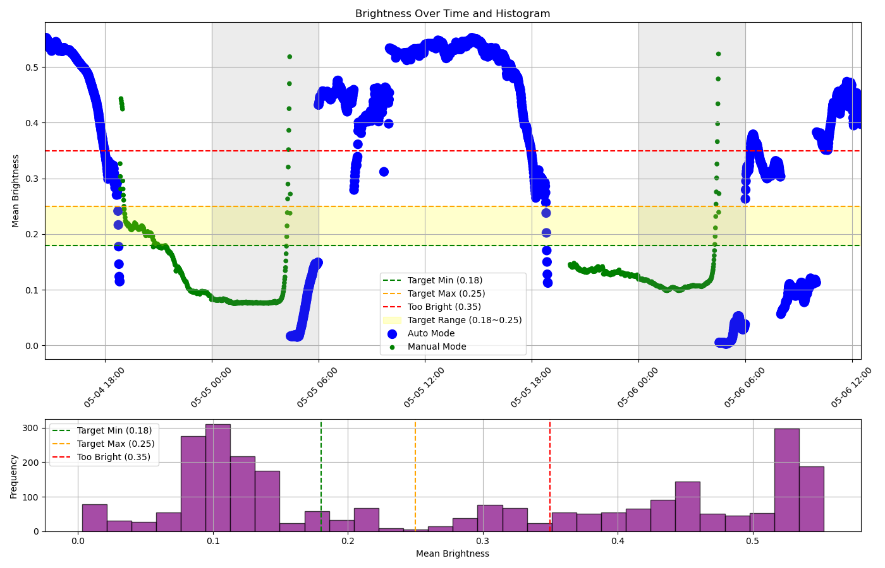

# 📷 timelapse-system

## 概要

`timelapse-system` は、Raspberry Pi Zero 2 W と Camera Module v3 を用いて、24×365 のタイムラプス撮影を自動化・安定運用するためのフルスタックソリューションです。
撮影 → ローカル・NAS への同期 → MJPEG ライブ配信 → リソース監視・Slack 通知 → 日次サマリ の一連ワークフローをスクリプトと systemd/timer、cron でシームレスに実現します。

---

## ✅ 主な機能

* 🕐 **指定間隔での自動撮影**（`scripts/capture.sh`）
* 🗂️ **前日分の画像を archived/ に30件ずつ移動**（`scripts/sync_to_archived.sh`）
* 💾 **NAS への前日分バッチ転送 + 50日以上削除**（`scripts/sync_to_nas.sh`）
* 📈 **明るさの異常検知、Slack 通知**（`alert_check_and_notify.py`）
* 📊 **撮影数、バックアップ情報のレポート**（`monitor.py`）
* 💬 **Slack 通知モジュール**（`slack_notifier.py`, `send_report_to_slack.py`）
* 📉 **明るさログよりグラフを作成**（`plot_mean.py`）
* 📡 **MJPEG ストリーミングサーバーでライブビュー表示**（`mjpeg_server.py`）

---

## 💻 前提条件

### ハードウェア

* Raspberry Pi Zero 2 W（Wi-Fi 接続済み）
* Camera Module v3 (IMX708)
* microSD カード（16 GB 以上推奨）

### ソフトウェア

* Raspberry Pi OS Lite (Bullseye)
* `libcamera-apps`（`rpicam-still`, `rpicam-vid`）
* `bash`, `python3`
* 必須パッケージ：`rsync`, `imagemagick`, `python3-psutil`, `python3-dotenv`, `slack_sdk`, `pandas`, `matplotlib`, `requests`

---

## 🗂 ディレクトリ構成

```bash
.
├── scripts/
│   ├── capture.sh                （毎分撮影）
│   ├── sync_to_archived.sh      （前日分を30件ずつ移動）
│   └── sync_to_nas.sh           （前日分をバッチ転送）
├── alert_check_and_notify.py    （明るさ検知）
├── monitor.py                   （撮影数・管理情報のレポート）
├── send_report_to_slack.py      （Slackへレポート通知）
├── plot_mean.py                 （明るさログのグラフ化）
├── slack_notifier.py            （Slack Webhook 管理）
├── mjpeg_server.py              （ライブビューサーバー）
├── .env                         （環境変数設定ファイル）
└── README.md                    （このファイル）
```

---

## 📦 インストール手順

```bash
git clone https://github.com/runsystem-hiro/timelapse-system.git
cd timelapse-system

sudo apt update
sudo apt install -y rsync imagemagick libcamera-apps python3-psutil
pip3 install python-dotenv slack_sdk pandas matplotlib requests

cp .env.example .env  # 内容を自環境に応じて編集
```

---

## ⚙️ `.env` 設定例

```dotenv
DISK_THRESHOLD=70.0
TEMP_THRESHOLD=65.0
SUPPRESS_MIN=30
LOAD_THRESHOLD=2.0
MEM_THRESHOLD=80.0
LOG_ROTATE_DAYS=30
NAS_DEST="rsync://yournas"
SLACK_BOT_TOKEN=xoxb-...
SLACK_DM_EMAIL=your@email.com
```

---

## 🕒 cron スケジュール

```cron
# 毎分撮影
* * * * * /home/pi/timelapse-system/scripts/capture.sh >> /home/pi/timelapse-system/log/cron.log 2>&1

# 2分おきに前日分をすこしずつ archived に移動（1回30枚まで）
*/2 * * * * ionice -c2 -n7 nice -n 19 /home/pi/timelapse-system/scripts/sync_to_archived.sh

# 毎日 2:10 にNAS同期＋50日超画像削除
10 2 * * * /home/pi/timelapse-system/scripts/sync_to_nas.sh

# 毎日 23:55 に残っていたストリームを終了
55 23 * * * pkill -f mjpeg_server.py

# mean アラート(60分おき)
0 * * * * /usr/bin/python3 /home/pi/timelapse-system/alert_check_and_notify.py >> /home/pi/timelapse-system/log/cron.log 2>&1

# meanレポート
30 0,6,12,18 * * * /usr/bin/python3 /home/pi/timelapse-system/send_report_to_slack.py >> /home/pi/timelapse-system/log/cron.log 2>&1
```

---

## ⏱ systemd-timer 設定例

### `/etc/systemd/system/monitor.service`

```ini
[Unit]
Description=Timelapse System Monitor

[Service]
Type=simple
ExecStart=/usr/bin/python3 /home/pi/timelapse-system/monitor.py
WorkingDirectory=/home/pi/timelapse-system
EnvironmentFile=/home/pi/timelapse-system/.env
Restart=on-failure
```

### `/etc/systemd/system/monitor.timer`

```ini
[Unit]
Description=Run Timelapse System Monitor Hourly

[Timer]
OnCalendar=hourly
Persistent=true

[Install]
WantedBy=timers.target
```

### 有効化コマンド

```bash
sudo systemctl daemon-reload
sudo systemctl enable --now monitor.timer
```

---

## ▶️ 使用例

### MJPEG ライブ配信（http\://\<PiのIP>:8080）

```bash
python3 mjpeg_server.py
```

ブラウザで `http://<RPI_IP>:8080` にアクセスしてください。

### 明るさグラフ付きSlackレポートを即時送信

```bash
python3 send_report_to_slack.py
```

### 任意日の日次サマリを送信

```bash
python3 monitor.py --daily --date 2025-05-01
```

### # 📷 timelapse-system

## 概要

`timelapse-system` は、Raspberry Pi Zero 2 W と Camera Module v3 を用いて、24×365 のタイムラプス撮影を自動化・安定運用するためのフルスタックソリューションです。
撮影 → ローカル・NAS への同期 → MJPEG ライブ配信 → リソース監視・Slack 通知 → 日次サマリ の一連ワークフローをスクリプトと systemd/timer、cron でシームレスに実現します。

---

## ✅ 主な機能

* 🕐 **指定間隔での自動撮影**（`scripts/capture.sh`）
* 🗂️ **前日分の画像を archived/ に30件ずつ移動**（`scripts/sync_to_archived.sh`）
* 💾 **NAS への前日分バッチ転送 + 50日以上削除**（`scripts/sync_to_nas.sh`）
* 📈 **明るさの異常検知、Slack 通知**（`alert_check_and_notify.py`）
* 📊 **撮影数、バックアップ情報のレポート**（`monitor.py`）
* 💬 **Slack 通知モジュール**（`slack_notifier.py`, `send_report_to_slack.py`）
* 📉 **明るさログよりグラフを作成**（`plot_mean.py`）
* 📡 **MJPEG ストリーミングサーバーでライブビュー表示**（`mjpeg_server.py`）

---

## 💻 前提条件

### ハードウェア

* Raspberry Pi Zero 2 W（Wi-Fi 接続済み）
* Camera Module v3 (IMX708)
* microSD カード（16 GB 以上推奨）

### ソフトウェア

* Raspberry Pi OS Lite (Bullseye)
* `libcamera-apps`（`rpicam-still`, `rpicam-vid`）
* `bash`, `python3`
* 必須パッケージ：`rsync`, `imagemagick`, `python3-psutil`, `python3-dotenv`, `slack_sdk`, `pandas`, `matplotlib`, `requests`

---

## 🗂 ディレクトリ構成

```bash
.
├── scripts/
│   ├── capture.sh                （毎分撮影）
│   ├── sync_to_archived.sh      （前日分を30件ずつ移動）
│   └── sync_to_nas.sh           （前日分をバッチ転送）
├── alert_check_and_notify.py    （明るさ検知）
├── monitor.py                   （撮影数・管理情報のレポート）
├── send_report_to_slack.py      （Slackへレポート通知）
├── plot_mean.py                 （明るさログのグラフ化）
├── slack_notifier.py            （Slack Webhook 管理）
├── mjpeg_server.py              （ライブビューサーバー）
├── .env                         （環境変数設定ファイル）
└── README.md                    （このファイル）
```

---

## 📦 インストール手順

```bash
git clone https://github.com/runsystem-hiro/timelapse-system.git
cd timelapse-system

sudo apt update
sudo apt install -y rsync imagemagick libcamera-apps python3-psutil
pip3 install python-dotenv slack_sdk pandas matplotlib requests

cp .env.example .env  # 内容を自環境に応じて編集
```

---

## ⚙️ `.env` 設定例

```dotenv
DISK_THRESHOLD=70.0
TEMP_THRESHOLD=65.0
SUPPRESS_MIN=30
LOAD_THRESHOLD=2.0
MEM_THRESHOLD=80.0
LOG_ROTATE_DAYS=30
NAS_DEST="rsync://yournas"
SLACK_BOT_TOKEN=xoxb-...
SLACK_DM_EMAIL=your@email.com
```

---

## 🕒 cron スケジュール

```cron
# 毎分撮影
* * * * * /home/pi/timelapse-system/scripts/capture.sh >> /home/pi/timelapse-system/log/cron.log 2>&1

# 2分おきに前日分をすこしずつ archived に移動（1回30枚まで）
*/2 * * * * ionice -c2 -n7 nice -n 19 /home/pi/timelapse-system/scripts/sync_to_archived.sh

# 毎日 2:10 にNAS同期＋50日超画像削除
10 2 * * * /home/pi/timelapse-system/scripts/sync_to_nas.sh

# 毎日 23:55 に残っていたストリームを終了
55 23 * * * pkill -f mjpeg_server.py

# mean アラート(60分おき)
0 * * * * /usr/bin/python3 /home/pi/timelapse-system/alert_check_and_notify.py >> /home/pi/timelapse-system/log/cron.log 2>&1

# meanレポート
30 0,6,12,18 * * * /usr/bin/python3 /home/pi/timelapse-system/send_report_to_slack.py >> /home/pi/timelapse-system/log/cron.log 2>&1
```

---

## ⏱ systemd-timer 設定例

### `/etc/systemd/system/monitor.service`

```ini
[Unit]
Description=Timelapse System Monitor

[Service]
Type=simple
ExecStart=/usr/bin/python3 /home/pi/timelapse-system/monitor.py
WorkingDirectory=/home/pi/timelapse-system
EnvironmentFile=/home/pi/timelapse-system/.env
Restart=on-failure
```

### `/etc/systemd/system/monitor.timer`

```ini
[Unit]
Description=Run Timelapse System Monitor Hourly

[Timer]
OnCalendar=hourly
Persistent=true

[Install]
WantedBy=timers.target
```

### 有効化コマンド

```bash
sudo systemctl daemon-reload
sudo systemctl enable --now monitor.timer
```

---

## ▶️ 使用例

### MJPEG ライブ配信（http\://\<PiのIP>:8080）

```bash
python3 mjpeg_server.py
```

ブラウザで `http://<RPI_IP>:8080` にアクセスしてください。

### 明るさグラフ付きSlackレポートを即時送信

```bash
python3 send_report_to_slack.py
```

### 任意日の日次サマリを送信

```bash
python3 monitor.py --daily --date 2025-05-01
```

### 📊明るさグラフ



---
